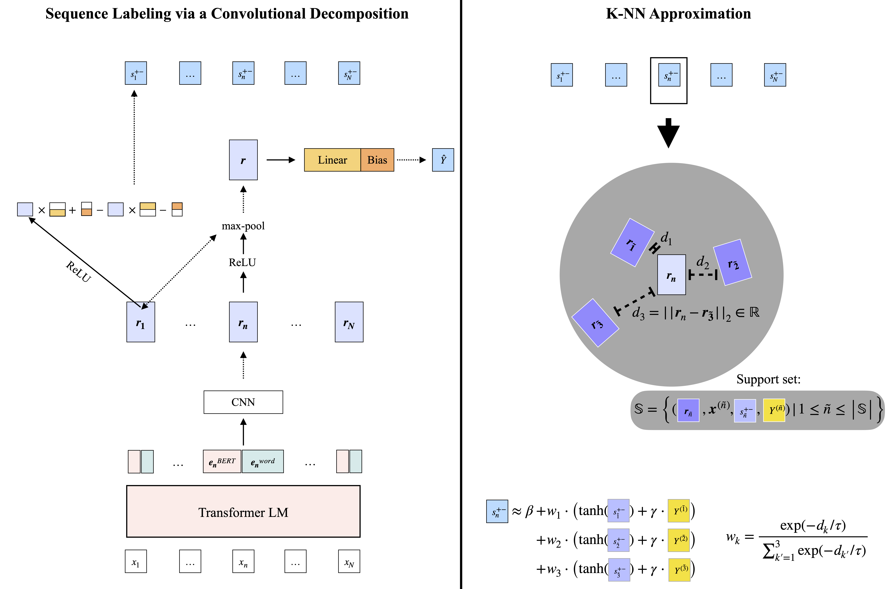

# Detecting Local Insights from Global Labels: Supervised & Zero-Shot Sequence Labeling via a Convolutional Decomposition

## Online Appendix

A brief additional appendix with further zero-shot sequence labeling comparisons is available here: [online_appendix/binary_appendix.pdf](online_appendix/binary_appendix.pdf).

## Overview


*High-level overview of the proposed methods. We derive token-level predictions from a model trained with document-level labels via the decomposition of a max-pooled, kernel-width-one CNN and a linear layer over a large Transformer language model (left). These token-level predictions can themselves be approximated as an interpretable weighting over a support set with known labels (right, where K=3 in the illustration) by leveraging the CNN's feature-specific, summarized representations of the deep network to measure distances to the support set.*

## Instructions

Examples of how to use the code and to replicate the presented experiments are provided here: [replication_scripts/README.md](replication_scripts/README.md).


## Citation

*Computational Linguistics* (to appear). The current arXiv citation for the [paper](https://arxiv.org/pdf/1906.01154v6.pdf) is as follows:
```bibtex
@misc{Schmaltz2021-Insights,
      title={Detecting Local Insights from Global Labels: Supervised & Zero-Shot Sequence Labeling via a Convolutional Decomposition},
      author={Allen Schmaltz},
      year={2021},
      eprint={1906.01154},
      archivePrefix={arXiv},
      primaryClass={cs.CL}
}
```
