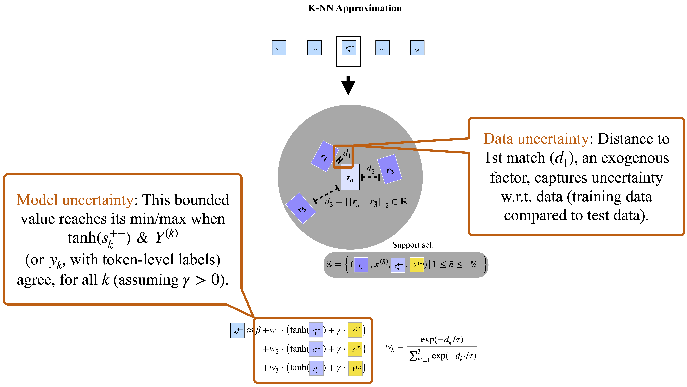

# Detecting Local Insights from Global Labels: Supervised & Zero-Shot Sequence Labeling via a Convolutional Decomposition

## Online Appendix

A brief additional appendix with further zero-shot sequence labeling comparisons is available here: [online_appendix/binary_appendix.pdf](online_appendix/binary_appendix.pdf).

## Overview


*High-level overview of the proposed methods. We derive token-level predictions from a model trained with document-level labels via the decomposition of a max-pooled, kernel-width-one CNN and a linear layer over a large Transformer language model (left). These token-level predictions can themselves be approximated as an interpretable weighting over a support set with known labels (right, where K=3 in the illustration) by leveraging the CNN's feature-specific, summarized representations of the deep network to measure distances to the support set.*


*The model approximations make explicit the connection to the data, and further yield heuristics for prediction reliability and screening input dissimilar to what the model saw in training, over which we would expect the network to produce unreliable outputs.*

## Instructions

Examples of how to use the code in this [repo](https://github.com/allenschmaltz/exa) and to replicate the presented experiments are provided here: [replication_scripts/README.md](replication_scripts/README.md).

The version of the code associated with [arXiv version 6](https://arxiv.org/pdf/1906.01154v6.pdf) (the version accepted to appear in *Computational Linguistics*) has the release tag `v6.0`.

## Presentations

The presentation [slides](emnlp_2021_presentation/emnlp_2021_cl_paper_1780_slides.pdf) and [poster](emnlp_2021_presentation/emnlp_2021_cl_paper_1780_poster.pdf) for EMNLP 2021 are available in this repo. A high-resolution copy of the pre-recorded presentation video is available on YouTube [here](https://youtu.be/iJ_udvksyqE).

## FAQ

I include an informal FAQ [here](faq/faq.pdf).

## Citation

*Computational Linguistics* (2021): [doi: https://doi.org/10.1162/coli_a_00416](https://doi.org/10.1162/coli_a_00416). BibTex:

```bibtex
@article{10.1162/coli_a_00416,
    author = {Schmaltz, Allen},
    title = "{Detecting Local Insights from Global Labels: Supervised and Zero-Shot Sequence Labeling via a Convolutional Decomposition}",
    journal = {Computational Linguistics},
    pages = {1-45},
    year = {2021},
    month = {10},
    abstract = "{We propose a new, more actionable view of neural network interpretability and data analysis by leveraging the remarkable matching effectiveness of representations derived from deep networks, guided by an approach for class-conditional feature detection. The decomposition of the filter-n-gram interactions of a convolutional neural network (CNN) and a linear layer over a pre-trained deep network yields a strong binary sequence labeler, with flexibility in producing predictions at—and defining loss functions for—varying label granularities, from the fully supervised sequence labeling setting to the challenging zero-shot sequence labeling setting, in which we seek token-level predictions but only have document-level labels for training. From this sequence-labeling layer we derive dense representations of the input that can then be matched to instances from training, or a support set with known labels. Such introspection with inference-time decision rules provides a means, in some settings, of making local updates to the model by altering the labels or instances in the support set without re-training the full model. Finally, we construct a particular K-nearest neighbors (K-NN) model from matched exemplar representations that approximates the original model’s predictions and is at least as effective a predictor with respect to the ground-truth labels. This additionally yields interpretable heuristics at the token level for determining when predictions are less likely to be reliable, and for screening input dissimilar to the support set. In effect, we show that we can transform the deep network into a simple weighting over exemplars and associated labels, yielding an introspectable—and modestly updatable—version of the original model.}",
    issn = {0891-2017},
    doi = {10.1162/coli_a_00416},
    url = {https://doi.org/10.1162/coli\_a\_00416},
    eprint = {https://direct.mit.edu/coli/article-pdf/doi/10.1162/coli\_a\_00416/1966946/coli\_a\_00416.pdf},
}
```
